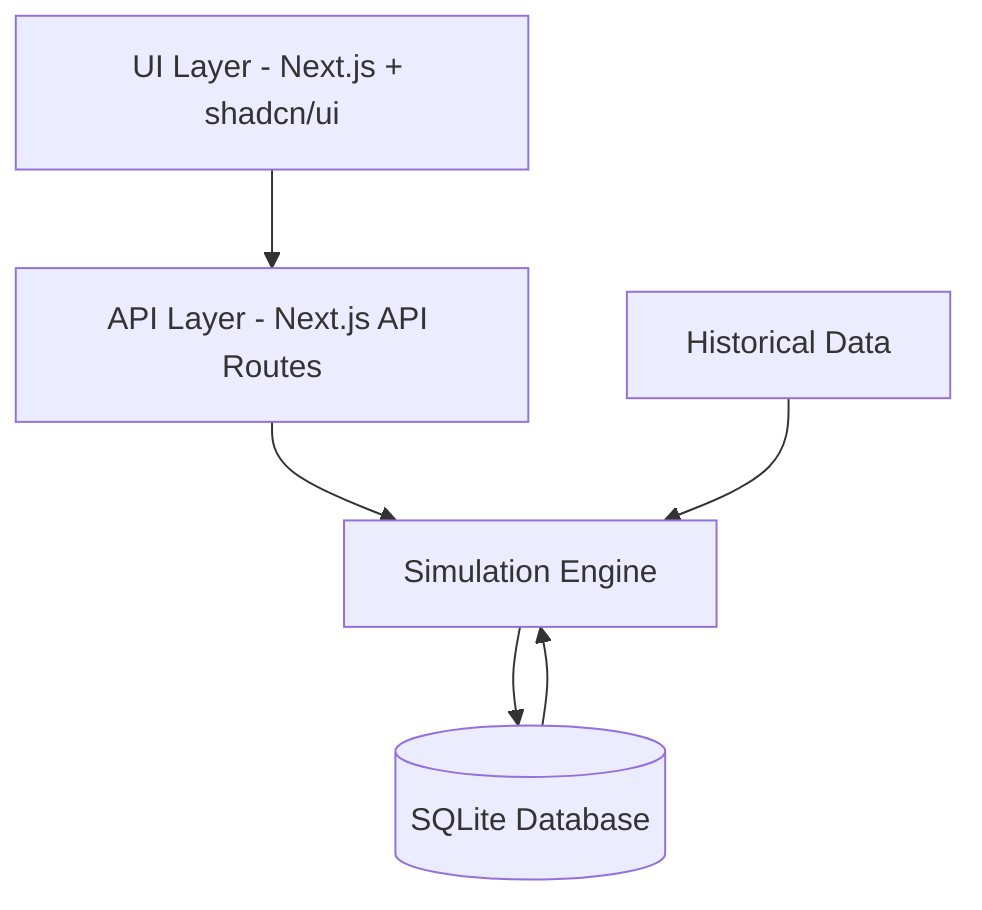

# Project Architecture - nextFire Calculator

## Overview
The nextFire Calculator is a modern FIRE planning tool built with a local-first architecture using Next.js. This document outlines the system's core components, data flows, and architectural decisions that enable powerful financial simulations while maintaining data privacy and performance.

## System Architecture



## Core Components

### 1. UI Layer
- **Technology:** Next.js, shadcn/ui, Tailwind CSS
- **Responsibilities:**
  - User input collection
  - Data visualization (Recharts/D3.js)
  - Interactive scenario management
  - Responsive layouts
- **Key Features:**
  - Form validation
  - Real-time updates
  - Chart interactions
  - Scenario comparison views

### 2. API Layer
- **Technology:** Next.js API Routes
- **Responsibilities:**
  - Request handling
  - Data validation
  - Simulation coordination
  - Response formatting
- **Endpoints:**
  - Historical data access
  - Scenario management
  - Simulation execution
  - URL sharing

### 3. Simulation Engine
- **Core Functions:**
  - Historical cycle calculations
  - Monte Carlo simulations
  - Fixed-rate projections
  - Withdrawal strategy implementations
- **Features:**
  - Multi-threaded processing
  - Result caching
  - Progress tracking
  - Error handling

### 4. Data Layer
- **Technology:** SQLite + Prisma ORM
- **Components:**
  - Historical market data (1871-present)
  - User scenarios
  - Simulation results
  - Custom streams

## Data Flow Patterns

### 1. Simulation Flow
```sequence
User->UI: Enter scenario parameters
UI->API: POST /api/simulations/historical
API->Engine: Process simulation
Engine->DB: Fetch historical data
Engine->Engine: Run calculations
Engine->DB: Cache results
API->UI: Return simulation results
UI->User: Display visualizations
```

### 2. Scenario Management
```sequence
User->UI: Create/modify scenario
UI->API: POST /api/scenarios
API->DB: Save scenario data
DB->API: Confirm save
API->UI: Return scenario ID
UI->User: Update UI state
```

## Key Architectural Decisions

### 1. Local-First Architecture
- **Rationale:**
  - Enhanced privacy
  - Offline capability
  - Reduced complexity
  - Better performance
- **Implementation:**
  - SQLite for local storage
  - Client-side processing
  - URL-based sharing

### 2. Modular Design
- **Core Modules:**
  ```
  src/
  ├── components/        # UI components
  ├── lib/
  │   ├── simulation/   # Calculation engine
  │   ├── database/     # Data access
  │   └── utils/        # Helpers
  ├── pages/
  │   └── api/          # API routes
  └── types/            # TypeScript definitions
  ```

### 3. Performance Optimizations
- **Strategies:**
  - Incremental calculations
  - Result caching
  - Lazy loading
  - Web Workers for heavy computations

## Data Models

### 1. Historical Data
```typescript
interface HistoricalData {
  year: number;
  equityReturns: number;
  bondReturns: number;
  inflation: number;
  // Additional metrics
}
```

### 2. Simulation Parameters
```typescript
interface SimulationParams {
  portfolioValue: number;
  annualSpending: number;
  assetAllocation: {
    stocks: number;
    bonds: number;
    // Optional allocations
  };
  withdrawalStrategy: {
    type: string;
    parameters: Record<string, any>;
  };
}
```

## Security Considerations

### 1. Data Privacy
- All data stored locally
- No external API dependencies
- URL parameters encoded safely

### 2. Input Validation
- Client-side validation
- API route validation
- Type checking
- Sanitization

## Error Handling

### 1. UI Layer
- Form validation feedback
- Error boundaries
- Loading states
- Recovery mechanisms

### 2. API Layer
- Standard error responses
- Validation errors
- Calculation errors
- Database errors

## Performance Guidelines

### 1. Simulation Performance
- Batch processing
- Memory management
- Progress indicators
- Result caching

### 2. UI Performance
- Code splitting
- Component optimization
- Asset optimization
- State management

## Development Workflow

### 1. Local Development
```bash
# Start development environment
npm run dev

# Run type checking
npm run type-check

# Execute tests
npm test
```

### 2. Production Build
```bash
# Create optimized build
npm run build

# Start production server
npm start
```

## Monitoring & Debugging

### 1. Development Tools
- React Developer Tools
- Chrome DevTools
- SQLite browser
- Performance profiler

### 2. Error Tracking
- Console logging
- Error boundaries
- Performance metrics
- State snapshots

Remember: This architecture prioritizes user privacy and performance while maintaining the flexibility to add features and optimizations as needed.
